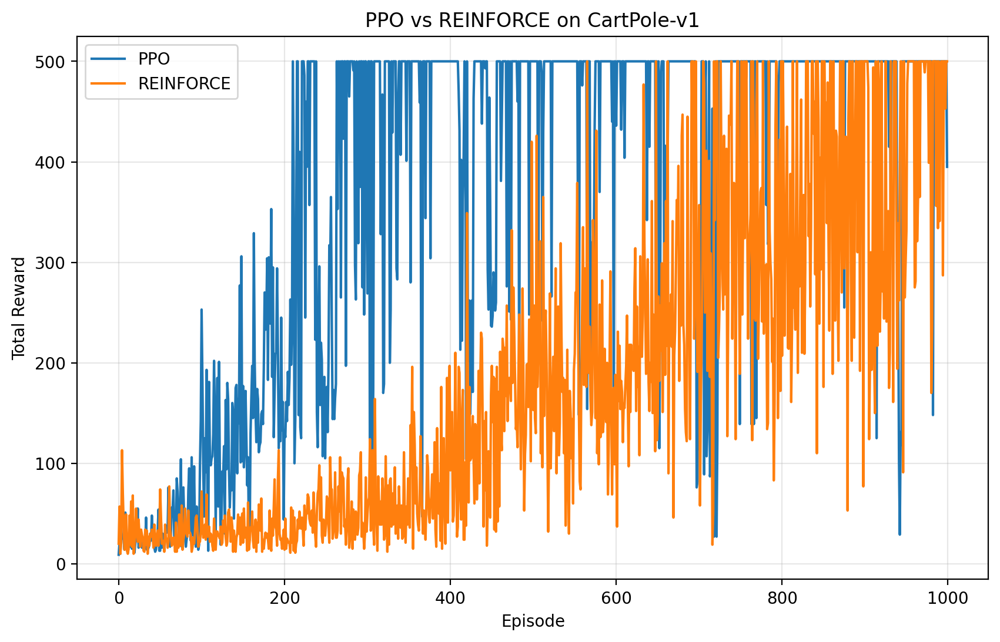
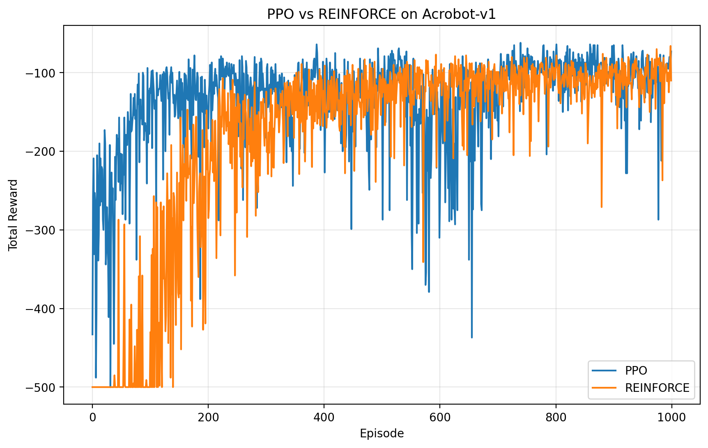

# TinyReproductions - PPO

## Project

This project implements and compares two policy gradient reinforcement learning algorithms:

- **REINFORCE (Vanilla Policy Gradient)**
- **Proximal Policy Optimization (PPO)**

Both methods are trained and evaluated on two classic control environments:

- `CartPole-v1`
- `Acrobot-v1`

The goal is to compare their learning performance and stability through reward curves.

---

## Code Structure

```
.
├── main.py                 # Main training script (this file)
├── results/                # Saved training plots
│   ├── comparison_cartpolev1.png
│   ├── comparison_acrobotv1.png
├── README.md               # Project documentation
├── requirements.txt        # Python dependencies
```

### Key Components in `main.py`

- **Hyperparameters**

  ```python
  gamma = 0.99
  lr = 1e-3
  eps_clip = 0.2
  episodes = 1000
  hidden_size = 64
  num_epochs = 4
  seed = 42
  ```

- **Policy Network (`Policy` class)**
  - 2-layer neural network
  - Outputs action probabilities using Softmax

- **compute_returns()**
  - Computes discounted rewards
  - Normalizes returns for training stability

- **train()**
  - The training loop
  - Supports both:
    - PPO (with clipping and entropy bonus)
    - REINFORCE (basic policy gradient)

- **Main Execution**
  - Runs both algorithms on each environment
  - Saves reward comparison plots

---

## How to Run

- Create environment and install dependencies:

```
python -m venv venv
source venv/bin/activate  # On Windows: venv\Scripts\activate
pip install -r requirements.txt
```

There is no external dataset/model download is needed because the code uses built-in Gymnasium environments

Run the script:

```bash
python main.py
```

## Code Attribution

- Lines 25–33 (Policy class): Adapted from the FeedForwardNN class in [Eric Yang Yu's network.py](https://github.com/ericyangyu/PPO-for-Beginners/blob/master/network.py). I simplified it from a three-layer network to a two-layer network and integrated it with Categorical distributions.
- Lines 36–44 (compute_returns): Written by me.
- Lines 47–121 (train function): Written by me, but logic for the PPO clipping (Lines 86–94) and ratio calculation (Line 88) was adapted from the implementation logic found in [Eric Yang Yu's ppo.py](https://github.com/ericyangyu/PPO-for-Beginners/blob/master/ppo.py).
- Lines 124–151 (Plotting/Main): Written by me.

## Results




## LLM Acknowledgment

ChatGPT was used to debug and optimize the training loop, particularly in implementing the PPO clipping mechanism and ensuring the correct calculation of the advantage estimates. The overall structure and logic of the code were designed by me, but ChatGPT provided guidance on best practices for PPO implementation and helped identify potential issues in the reward normalization process.
